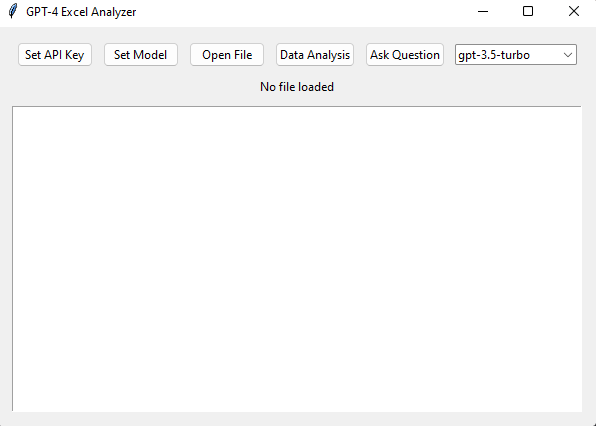

Title: Excel Data Analyzer with OpenAI Integration

Description: This project is a Python-based tool that enables users to analyze and summarize data from Excel files using OpenAI's GPT-powered models.
The tool extracts data from the selected Excel file, generates a summary, suggests potential graphs for visualization, and provides questions that users can ask to gain further insights into the data. 

With an easy-to-use graphical user interface (GUI) built with Tkinter, users can conveniently upload their Excel files, select the OpenAI model they want to use (GPT-3.5-turbo or GPT-4), and input their API key to access OpenAI's services.
This tool aims to streamline data analysis tasks and enable users to explore their data more effectively and efficiently.
